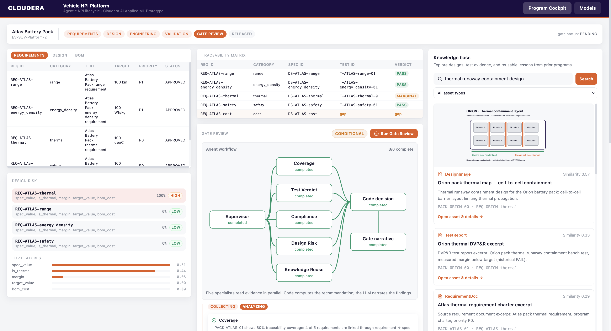

# Cloudera Blueprint: Vehicle NPI Gate Review

An AMP-ready prototype for EV battery-pack New Product Introduction (NPI) gate reviews. It shows a concrete Cloudera AI pattern: query engineering data, retrieve multimodal knowledge, apply traditional ML, and use agents to assemble an auditable report for a human approver.

## Table of Contents

- [Overview](#overview)
- [Program Cockpit](#program-cockpit)
- [Demo](#demo)
- [Use Case](#use-case)
- [Key Features](#key-features)
- [Quickstart / Guide](#quickstart--guide)
- [Deploy in Cloudera AI Workbench](#deploy-in-cloudera-ai-workbench)
- [Architecture / Software Components](#architecture--software-components)
- [Target Audience](#target-audience)
- [Repository Structure](#repository-structure)
- [Prerequisites](#prerequisites)
- [Hardware Requirements](#hardware-requirements)
- [Documentation](#documentation)

## Overview

Vehicle NPI Gate Review helps manufacturing engineering teams decide whether a new battery-pack design can move through a release gate. The prototype runs on Cloudera AI Workbench as a private application. It brings requirements, designs, DVP&R test results, ML risk signals, and historical technical assets into one cockpit, while preserving the core rule: **code decides, LLM narrates**. The system computes every score, verdict, and recommendation deterministically; agentic AI assembles evidence and explains it for a human decision.

## Program Cockpit

The cockpit is the demo's evidence-to-decision surface. The screenshot below shows the Atlas Battery Pack review in its pending gate state:



The three-column layout follows the reviewer's path through the evidence:

- **Requirements and design risk** — approved requirements sit beside the feature-based risk panel, with the thermal requirement surfaced as **HIGH**.
- **Traceability and gate review** — requirement-to-test coverage, verdicts, the five-worker workflow, and the deterministic **CONDITIONAL** recommendation are visible together.
- **Knowledge base** — historical design images, test reports, and requirement excerpts provide cited context for the human reviewer.

The application keeps the decision boundary visible: the engineering and ML computations produce the facts, agents gather and narrate evidence, and a human decides whether to release, condition, or hold the program.

## Demo

The demo follows `PACK-ATLAS-01`, a new EV battery-pack design at a gate review. Its thermal-containment requirement is independently flagged by two signals: the traditional `GradientBoostingClassifier` scores the requirement **HIGH** risk from design requirements, design values, test-related features, and BOM context, while its DVP&R result is **MARGINAL**. Five workers collect traceability, test, compliance, design-risk, and knowledge-reuse evidence; the deterministic gate function returns **CONDITIONAL** for human review.

Use [the demo storyline](docs/demo_storyline.md) for a guided walkthrough, or [the Chinese version](docs/demo_storyline_zh.md) for customer-facing narration.

## Use Case

Engineering teams often review requirements, design specifications, tests, standards, and past project documents in separate systems. This slows gate reviews and makes it difficult to explain why a product should proceed, pause, or require conditions. This blueprint shows a narrow, concrete pattern for combining those sources into a traceable gate-review report without letting an LLM control a safety or release decision.

## Key Features

- Deterministic APQP-style gate review for a battery-pack NPI program.
- Traditional ML design-risk scoring with feature explanation and stable risk bands.
- DVP&R test bench, requirement traceability, and standards-coverage checks.
- Lance multimodal knowledge retrieval for design images, technical documents, test reports, and reference photographs.
- Five-worker agentic workflow that gathers evidence and streams a narrative; a pure function computes PASS, CONDITIONAL, or FAIL.
- Private Cloudera AI AMP application, API-v2 deployment automation, GitHub Actions validation, and an optional stdio MCP adapter.

## Quickstart / Guide

### Local demo

```bash
python -m pip install -r requirements.txt
cp config/config.yaml.example config/config.yaml
python 02_backend/data_generation/generate_synthetic_data.py
python 02_backend/scripts/prepare.py
python start_app.py
```

Open the URL printed by `start_app.py` (normally `http://localhost:8100`). Run the Atlas gate review and inspect the requirements, risk panel, traceability matrix, workflow graph, knowledge cards, and report.

No live LLM is required. When no configured provider is available, the workers and narrative use deterministic templates. Set `config/config.yaml` to use CAII, vLLM, or Ollama for narration; the LLM still cannot change computed outcomes.

## Deploy in Cloudera AI Workbench

Choose one of two deployment paths: launch the AMP from the Cloudera AI catalog, which creates the project and runs its declared tasks, or create a project from this repository and run the same preparation sequence as Jobs. The deployment expects a Python 3.11 Standard runtime and persistent project storage; it needs no GPU and no LLM credential for the deterministic demo.

Cloudera AI imports the standard AMP contract from [`.project-metadata.yaml`](.project-metadata.yaml). [`project.yaml`](project.yaml) is the companion project contract used by the repository validator and deployment documentation; it records the matching runtime, preparation sequence, Application, and storage layout.

Run the declared tasks in order:

1. **Install Dependencies**
2. **Generate Synthetic Data**
3. **Prepare Data, Model & KB**
4. **Verify Prepared Demo**
5. **Vehicle NPI Platform**

The final task starts a private, SSO-protected application. Workbench assigns `CDSW_APP_PORT`; the application serves the frontend and proxies `/api` to a loopback FastAPI process.

For a manual application setup after preparation, use these settings:

| Setting | Value |
| --- | --- |
| Script | `03_frontend/start_frontend.py` |
| Resources | 2 vCPU, 8 GB RAM, no GPU |
| Runtime | Python 3.11 Standard |
| Environment | `BACKEND_PORT=7078`, `NPI_APP_MODE=prod`; optionally `LLM_PROVIDER=caii` |
| Access | Keep unauthenticated access disabled; Workbench SSO protects the cockpit |

Do not define `CDSW_APP_PORT`; Workbench supplies it. Open the generated Application link, choose `PACK-ATLAS-01`, and run the review. The expected demonstration result is thermal **HIGH** risk, a **MARGINAL** thermal test, and a **CONDITIONAL** recommendation for human action.

### Automated deployment

GitHub Actions validates the AMP manifest, backend/MCP tests, and frontend on pull requests and `main`. The manual or `main` deployment workflow uses CAI API-v2 automation to create or reuse a project, run preparation, then create/restart the private Application. Configure these GitHub Actions secrets: `CML_HOST`, `CML_API_KEY`, and `RUNTIME_IDENTIFIER`. Optionally set `CML_PROJECT_ID` for an existing project and `CML_GIT_URL` when the default repository URL is not cloneable by Workbench.

The deployment API key is never forwarded to an Application, Job, or MCP client. See [the CAI deployment guide](cai_integration/README.md) for exact commands and diagnostics.

## Architecture / Software Components

```text
Cloudera AI Workbench Application
  React Program Cockpit on CDSW_APP_PORT
    → /api proxy → FastAPI on 127.0.0.1:7078
      → read-only CSV source: programs, requirements, designs, BOM, test plans
      → SQLite operations store: test results, ML scores, reviews, evidence
      → Lance knowledge base: image/document/text assets and embeddings
      → deterministic test bench, traceability, ML risk model, gate function
      → supervisor + five evidence workers → streamed narrative and report

Optional external agent client
  stdio npi-mcp → authenticated Application API
```

The traditional ML model uses historical requirement and design features to produce risk scores. The agentic workflow queries every relevant component, persists evidence snapshots, and writes a trustworthy narrative around a recommendation produced only by the deterministic `decide()` function. The human project reviewer remains responsible for approval.

## Target Audience

- Manufacturing and NPI program managers running APQP or stage-gate reviews.
- Battery-pack, validation, quality, and systems engineers who need evidence across requirements, design, tests, and standards.
- Solution architects and data/AI teams evaluating Cloudera AI for governed data, ML, multimodal retrieval, and agentic workflow integration.

## Repository Structure

| Path | Description |
| --- | --- |
| `01_installer/` | Python dependency, Node.js, and frontend installer. |
| `02_backend/` | FastAPI API, deterministic engineering logic, ML, Lance KB, agents, tests, and seed generation. |
| `03_frontend/` | React cockpit and the Workbench application launcher. |
| `cai_integration/` | API-v2 deployment automation, AMP validation, smoke checks, and runbook. |
| `mcp_server/` | Separately installable `npi-mcp` stdio adapter for the Application API. |
| `config/` | Example configuration for data locations and optional narration providers. |
| `data/` | Generated CSV source, SQLite operations data, and Lance KB artifacts. |
| `docs/` | Architecture, component contracts, development guide, user guide, and demo stories. |
| `.project-metadata.yaml` | CAI AMP task manifest. |
| `project.yaml` | Operator-facing project contract, validated against the AMP manifest. |
| `METADATA.yaml` | Blueprint catalog metadata. |

## Prerequisites

- Python 3.11 or later, Node.js 22.12 or later, and npm for local execution.
- Cloudera AI Workbench access with a Python 3.11 Standard runtime for AMP use.
- A CAI API-v2 key only for automated deployment; it is not required for the local demo and must not be used as an application or MCP token.
- Optional CAII, vLLM, or Ollama endpoint for live narration. The offline demo runs without one.

## Hardware Requirements

| Deployment | Minimum |
| --- | --- |
| Local or AMP demo preparation | 2 CPU, 4 GB RAM, 2 GB free storage, no GPU |
| CAI application | 2 CPU, 8 GB RAM, persistent project storage, no GPU |
| Production extension | Size for source volume, concurrent reviews, model, and knowledge corpus; use managed storage and separate operational controls |

## Documentation

- [Project overview](docs/project-overview.md)
- [Architecture](docs/architecture.md)
- [Development guide](docs/development.md)
- [Component and API contracts](docs/component-api.md)
- [User guide](docs/user-guide.md)
- [Demo storyline](docs/demo_storyline.md)
- [CAI Workbench deployment plan](docs/workbench-deployment-plan.md)
- [Iceberg and Lance lakehouse enhancement plan](docs/iceberg-lance-lakehouse-plan.md)
